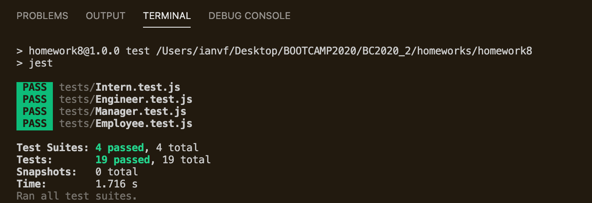
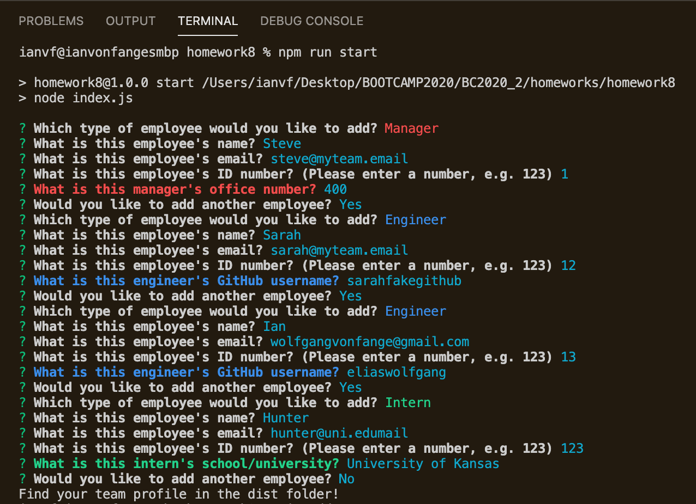

# Team Profile Generator
A simple CLI built using Inquirer, Chalk, Node.js, and vanilla JavaScript

## Table of Contents

-[Description](#description)\
-[Installation](#installation)\
-[License](#license)\
-[Testing](#testing)\
-[Images](#images)

## Description
This HTML generator takes user input from a CLI run using [inquirer npm](https://www.npmjs.com/package/inquirer) and returns a sleek, responsive web-development team profile page. Using [chalk npm](https://www.npmjs.com/package/chalk), the CLI is color-coded to match the HTML styling, and the HTML is built using [Bootstrap v 4.6](https://getbootstrap.com/docs/4.6/getting-started/introduction/). Check out the index.html file in the *dist* folder of this repository for a sample.

## Installation
For all users who have [Node.js](https://nodejs.org/en/) installed, simply clone this repository into a local directory and run
```
npm i
```
from the command line (Terminal or GitBash) in your root directory. All required dependencies will be taken care of!

To run the application, enter
```
npm run start
```
into your command line at the root directory, and answer all prompts.

## License
[](https://opensource.org/licenses/ISC)

## Testing
In the *tests* folder, you'll find basic tests for each class used to generate the HTML. Simply run
```
npm run test
```
from the command line to ensure class functionality.


## Images
What the application's CLI looks like:


What the generated HTML will look like in a browser:
" width=100%>

And check out a video demo of the working application [here](https://drive.google.com/file/d/1WXuCRkhl5DR_1iiQlRD9qnwsCI6BWd8y/view).